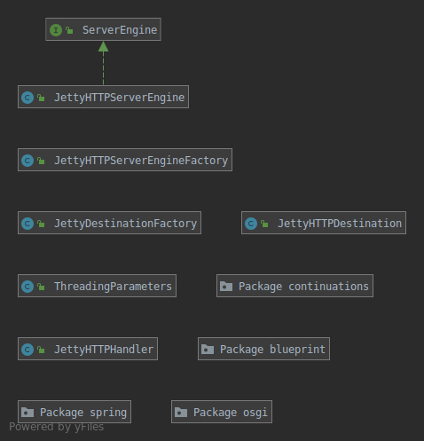
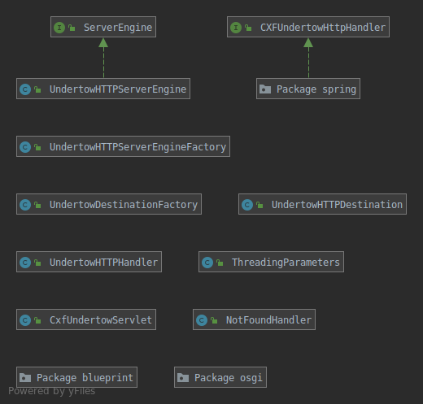
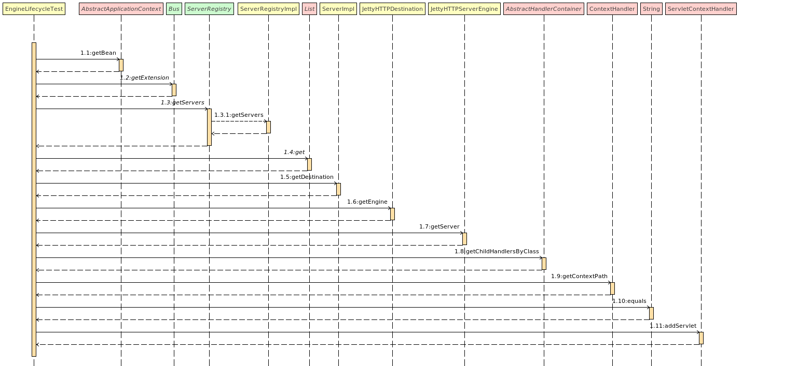

# Documentation

This document summarises knowledge about the Jetty and Undertow implementations as transports in CXF. Additionally, it describes possible implementations for an embedded Tomcat server as a transport in CXF.

## Comparing Jetty and Undertow implementations

### Class diagrams

#### Jetty as a transport in CXF

#### Undertow as a transport in CXF

### Similarities

When comparing the implementation of [Jetty](https://github.com/gcorsini/cxf/tree/master/rt/transports/http-jetty/src/main/java/org/apache/cxf/transport/http_jetty) and [Undertow](https://github.com/gcorsini/cxf/tree/master/rt/transports/http-undertow/src/main/java/org/apache/cxf/transport/http_undertow) as transports in CXF, many similarities can be identified.

As seen in the class diagrams above, both implementations extend an interface called ServerEngine with their own HTTPServerEngine class. This class describes the transport connection, configures a session, starts/destroys a server, etc. Hence, this is a very important class to implement in order to use Tomcat as a transport. (Maybe, not all classes will be necessary for the proof of concept.)

The class HTTPDestination binds the bus with the realization. This enables the transaction of messages.

The class HTTPHandler enables the delivery messages to a client from the server. Hence, the messages from the server are handded over to the HTTPHandler. The HTTPHandler then uses the HTTPDestination class in order to execute the requests on the underlying servlet.

There is also the class ThreadingParameters, which helps to setup the correct number of threads in the embedded server.

Finally, both transports use the factory pattern as a design pattern in their implementations. Therefore, there are several factory classes in both implementations (for example HTTPServerEngineFactory or DestinationFactory).

### Differences 

One of the main difference is that Undertow has an interface [CXFUndertowHttpHandler](https://github.com/gcorsini/cxf/blob/master/rt/transports/http-undertow/src/main/java/org/apache/cxf/transport/http_undertow/CXFUndertowHttpHandler.java) and two additional classes [CxfUndertowServlet](https://github.com/gcorsini/cxf/blob/master/rt/transports/http-undertow/src/main/java/org/apache/cxf/transport/http_undertow/CxfUndertowServlet.java) and [NotFoundHandler](https://github.com/gcorsini/cxf/blob/master/rt/transports/http-undertow/src/main/java/org/apache/cxf/transport/http_undertow/NotFoundHandler.java). The interface CXFUndertowHttpHandler and the class NotFoundHandler extends HttpHandler and are additional to the [UndertowHTTPHandler](https://github.com/gcorsini/cxf/blob/master/rt/transports/http-undertow/src/main/java/org/apache/cxf/transport/http_undertow/UndertowHTTPHandler.java). The class CxfUndertowServlet implements the class AbstractHTTPServlet of the spring framework.

The other difference is that Jetty contains a folder called [continuations](https://github.com/gcorsini/cxf/tree/master/rt/transports/http-jetty/src/main/java/org/apache/cxf/transport/http_jetty/continuations), which mostly handles servlet requests and responses.

## Description of EngineLifecycleTest (Jetty specific)

The test class [EngineLifecycleTest](https://github.com/gcorsini/cxf/blob/master/systests/transports/src/test/java/org/apache/cxf/systest/http_jetty/EngineLifecycleTest.java) is a specific Jetty implementation. A similar test for the Undertow implementation is missing. The test class contains two tests:
* [testUpDownWithServlets](https://github.com/gcorsini/cxf/blob/ba95fa0178063986f7ae2579fda808f1dd7c740e/systests/transports/src/test/java/org/apache/cxf/systest/http_jetty/EngineLifecycleTest.java#L61) 
* [testServerUpDownUp](https://github.com/gcorsini/cxf/blob/ba95fa0178063986f7ae2579fda808f1dd7c740e/systests/transports/src/test/java/org/apache/cxf/systest/http_jetty/EngineLifecycleTest.java#L88)

The first test [testUpDownWithServlets](https://github.com/gcorsini/cxf/blob/ba95fa0178063986f7ae2579fda808f1dd7c740e/systests/transports/src/test/java/org/apache/cxf/systest/http_jetty/EngineLifecycleTest.java#L61) checks if a created embedded Jetty server can be used as a transport in CXF. After setting up the embedded Jetty server, it adds a servlet to it. Then it verfies its availability and invokes the service. Finally, the server is shutdown. Here is a sequence diagram of this test:

The second test [testServerUpDownUp](https://github.com/gcorsini/cxf/blob/ba95fa0178063986f7ae2579fda808f1dd7c740e/systests/transports/src/test/java/org/apache/cxf/systest/http_jetty/EngineLifecycleTest.java#L88) creates an embedded Jetty server, checks the availability of a static page and destroys the server. This is done twice and ensures that the shutdown is successful without hindering a new start.

